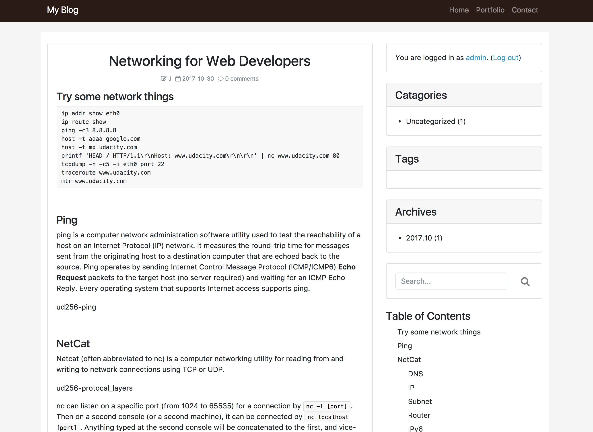

# Django Blog

Django Blog is a blog web application built with Django. It allows authorized users to publish and manage blog posts, and registered users to make comments. Data are stored in MySQL database.

## Features

* Straightforward backend forms
* Markdown support
* Draft and preview support
* Two-step user registration and activation process
* Threaded comment
* Customizable avartar
* RSS subscription
* Full text search

## Demo

